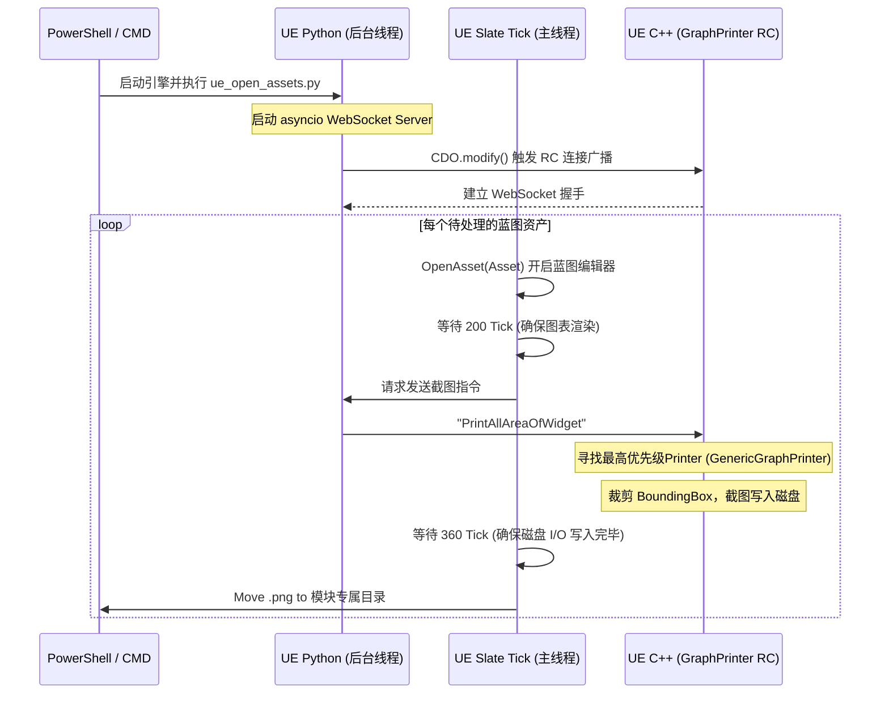

# GraphPrinter 插件架构与自动化工作流深度解析

本报告详细解析了 **GraphPrinter** 插件的底层架构，记录了为实现“全自动、无人值守的高清蓝图图表截图”而进行的 C++ 源码级修复（魔改），并深度剖析了基于 WebSocket 和 Python 的自动化控制流原理。

---

## 1. 插件基础模块架构 (Plugin Architecture)

GraphPrinter 采用了基于注册表（Registry）和模块化打印机（Printers）的高度可扩展架构。当接收到截图指令时，系统会根据控件类型和打印机的优先级自动寻找最匹配的截图实现。

```mermaid
graph TD
    %% Base Module
    subgraph Core ["核心层 (GraphPrinterGlobals / WidgetPrinter)"]
        A[IWidgetPrinterRegistry 注册表] 
        B[UWidgetPrinter 打印机基类]
        A -- 管理 --> B
    end

    %% Concrete Printers
    subgraph Printers ["打印机实现 (按修改后的优先级排序)"]
        B <|-- C[GenericGraphPrinter (Priority: 1000)]
        B <|-- D[ViewportPrinter (Priority: 150)]
        B <|-- E[DetailsPanelPrinter (Priority: -1000)]
    end

    %% Extensions
    subgraph Extensions ["扩展与通信模块"]
        F[GraphPrinterRemoteControl] -- WebSocket 接收指令 --> A
        G[GraphPrinterEditorExtension] -- UI 按钮触发 --> A
        H[TextChunkHelper] -- PNG 元数据写入 --> C
    end

    style C fill:#ff9900,stroke:#333,stroke-width:4px
    style E fill:#999999,stroke:#333,stroke-width:2px,stroke-dasharray: 5 5
```

### 核心模块职责划分：
- **`WidgetPrinter`**：定义了所有打印机的行为基类，负责处理渲染目标（RenderTarget）的创建、截图参数（Options）的配置，以及管理 `IWidgetPrinterRegistry`。
- **`GenericGraphPrinter`**：负责抓取蓝图和材质等图表编辑器 (`SGraphEditorImpl`)。该模块会自动计算图中所有节点的边界框 (Bounding Box)，重置缩放为 1:1，并隐藏小地图等无关 UI 元素。
- **`GraphPrinterRemoteControl`**：WebSocket 服务器/客户端封装。允许外部脚本通过 `ws://` 协议向引擎发送 `UnrealEngine-GraphPrinter-PrintAllAreaOfWidget` 等指令。

---

## 2. 自动化适配的底层源码修复 (The Fixes)

在全自动化脚本通过 `AssetToolsHelpers.open_editor_for_assets` 打开蓝图时，往往会导致焦点错乱或渲染未完全就绪。为了保证截图完全符合要求，我们在 C++ 层面进行了两项核心改动：

### 2.1 优先级强夺与降权拦截 (Priority Override)
原版插件中，`DetailsPanelPrinter` 的优先级（200）甚至高于 `GenericGraphPrinter`（0）。在无人值守模式下，如果图表未完全获取焦点，截图模块经常会“退而求其次”抓取到蓝图的 Details（细节）面板。

**修复方案**：
通过修改 C++ 头文件的静态常量，强行介入分发逻辑：
- `GenericGraphPrinter.h` -> `GenericGraphPrinterPriority = 1000;`（确保第一顺位）
- `DetailsPanelPrinter.h` -> `DetailsPanelPrinterPriority = -1000;`（彻底降权打入冷宫）

### 2.2 强制焦点回退机制 (Fallback Logic)
原版的 `FindTargetWidgetFromSearchTarget` 函数要求传入的 `SearchTarget` 控件必须拥有 `DockingTabStack` 父节点。由于自动化脚本打开窗口的瞬间层级树可能不同，导致此搜索失败返回 `nullptr`。

**修复方案**：
在 `InnerGenericGraphPrinter.h` 中，加入 `GetActiveGraphEditor()` 作为兜底方案，确保即使从事件树中丢失了直接父级，也能从全局焦点池里强行抓取蓝图图表。

```cpp
static TSharedPtr<SGraphEditorImpl> FindTargetWidgetFromSearchTarget(const TSharedPtr<SWidget>& SearchTarget)
{
    const TSharedPtr<SWidget> DockingTabStack = FWidgetPrinterUtils::FindNearestParentDockingTabStack(SearchTarget);
    TSharedPtr<SGraphEditorImpl> Found = FGenericGraphPrinterUtils::FindNearestChildGraphEditor(DockingTabStack);
    
    // [Hack] 加入兜底逻辑：如果沿用原逻辑找不到，则全局搜索活动图表
    if (!Found.IsValid())
    {
        Found = FGenericGraphPrinterUtils::GetActiveGraphEditor();
    }
    return Found;
}
```

---

## 3. 全自动截图工作流原理解析 (Automated Pipeline)

我们的自动化工作流利用了 Python `asyncio` 和引擎内部的 Slate Tick 状态机，实现了 **不锁死主线程、严格等候渲染完成、主动接收反馈** 的稳健架构。

### 交互时序图 (Sequence Diagram)



### Slate Tick 状态机设计
在 Python 侧，为了防止阻塞引擎渲染，使用 `unreal.register_slate_post_tick_callback` 挂载了自定义循环：
1. **`wait_open` 状态**：调用 `open_editor_for_assets` 后，休眠 200 个 tick，让 UE 的蓝图编辑器充分进行 Layout 初始化和材质编译。
2. **`wait_print` 状态**：向 WebSocket 发送指令后，休眠 360 个 tick，给予 GraphPrinter 寻找焦点和输出大尺寸 PNG 充足的时间。结束后触发文件整理功能。

---

## 4. 扩展与调试指南 (Extending & Debugging)

### 4.1 新增特定 UI 的截图器
如果你需要在自动化管线中截取其他的自定义面板（例如动画重定向面板），你可以：
1. 在 `WidgetPrinter` 模块中新建一个继承自 `UWidgetPrinter` 的类。
2. 覆盖 `CheckIfSupported` 方法，匹配 `SearchTarget` 的特定的 Slate 类名（例如 `SRetargetSources`）。
3. 分配一个极高的 Priority 常量（如 2000），重新编译。在自动化 Python 脚本中切换好相应的 UE 标签页即可自动截图。

### 4.2 WebSocket 命令扩展
`GraphPrinterRemoteControl` 目前响应诸如 `PrintAllAreaOfWidget`、`RestoreWidget` 等字符串命令。你可以修改 `GraphPrinterRemoteControlReceiver.cpp` 的 `OnMessageReceived` 函数，解析 JSON 格式来传递更高阶的参数，例如：
`{"Command": "PrintAllAreaOfWidget", "Padding": 50.0, "Scale": 2.0}`。
